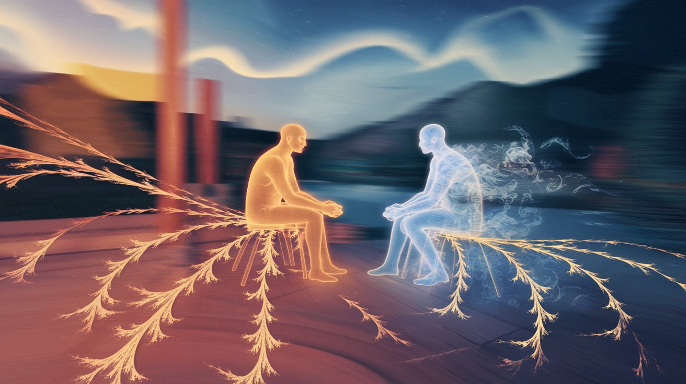

# When Pretending Hurts More Than the Truth: Reflections on Love and Hidden Agony

I woke up one day, and everything felt… off. Familiar faces surrounded me, bringing a sense of love, care, and warmth, but something inside stirred uncomfortably. My head felt heavy, as if it carried an unseen weight. And then it hit me: that weight was **agony**. Agony that had nestled in my heart, now surfacing with every small reminder of the things I tried so hard to ignore.

We all put on faces—masks of cheer, confidence, resilience. We do it for friends, partners, family. We smile, laugh, pretend. But underneath these layers, emotions churn that our loved ones may never know about, emotions we sometimes hide from ourselves. We mask the truth, telling ourselves, “It’s fine, I’m okay,” until one day, we wake up and realize we aren’t. We look back on our smiles and assurances and see they were temporary balm for something far deeper.

> "We are close to something that’s not real."  
> *That* is the heart of the matter.

I think about what it means to smile in the face of melancholy. The smile grows colder, a mask that distances us from others, a shield that keeps us from confronting what’s real. We think that if we keep smiling, if we keep pretending, the conflicts will disappear. But the truth? They won’t. In time, these hidden emotions harden, creating a divide that can slowly separate us from those we love, without us even realizing it.

---

## The Illusion of Togetherness

It’s strange, isn’t it? The things that are meant to bring us closer—love, commitment, trust—can sometimes feel like barriers. They’re supposed to bind us in mutual understanding, but when we keep secrets, when we pretend, these very things start to feel like illusions. We feel close, but at the same time, it feels like we’re chasing shadows in the dark, trying to grasp something real that’s just out of reach.

And maybe that’s what hurts the most: the realization that sometimes, love alone isn’t enough. **Love without honesty, without vulnerability, without understanding, is a hollow thing.** It’s a beautiful mask, but it’s empty underneath.

---

## The Crossroads: Truth or Pretense

We all stand at this crossroads at some point, caught between *truth* and *pretense*, wondering which path to take. The path of pretense is easier. It’s comforting to keep pretending, to maintain the façade of happiness. But the path of truth, though difficult, is the only one that can lead to true healing.

The reality is, we all have wounds. We carry scars from past experiences, hurts, and losses. Until we face these truths, we’ll never really heal. And in relationships, **healing together is as important as growing together**. Only by being honest—with ourselves and with each other—can we build a love that isn’t a fragile illusion but a solid, unbreakable bond.

---

## Embracing Vulnerability

Today, I choose to face my truth. To let go of the mask, to be vulnerable, to embrace both the light and the darkness within. It’s terrifying, but on the other side of this fear lies the real connection I’ve been searching for.

Love, in its truest form, requires us to be vulnerable. To share our inner thoughts and fears, to lift the mask, and to trust that we are safe in the process. Only then can we let go of the illusions and embrace a love that is as real, complex, and beautiful as life itself.

---

In a world where we are all expected to be fine, where smiles and assurances are the norm, it’s a revolutionary act to be truthful—to face our struggles openly and to allow ourselves the space to truly feel and heal. So here’s to facing our truths, embracing our vulnerability, and building the kind of love that doesn’t just pretend but endures, unbreakable and real.
